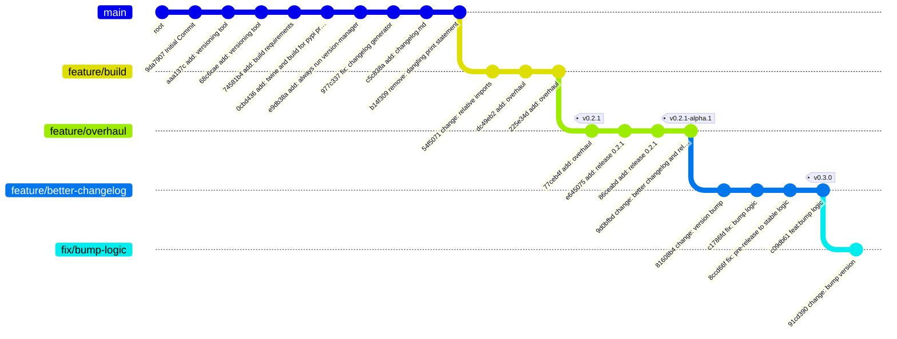

# Python Versioning and Changelog Utility

This repository includes a pre-push hook utility to ensure your Python package version is **properly bumped** before pushing to `main` or other important branches. It supports **feature, beta, and release candidate (RC) branches**, handles pre-release versions automatically, and can optionally use [Rich](https://github.com/willmcgugan/rich) for beautiful console output.
Having generated the version bump, it will also generate a changelog entry in `CHANGELOG.md` with the current date and the new version.

---

## Branch & Versioning Strategy

Our recommended workflow follows **semantic versioning** with pre-release identifiers:

- `feature/*` → `alpha` pre-release
- `beta/*` → `beta` pre-release
- `rc/*` → `rc` pre-release
- `main` → production release

### 1️⃣ Feature Development

- Create a `feature/*` branch for each new feature.
- Work and commit as usual.
- **Versioning:** Auto-increment `alpha` pre-release (e.g., `1.0.0-alpha.1 → 1.0.0-alpha.2`).
- Merge completed features into the corresponding `beta/*` branch when ready for integration testing.

### 2️⃣ Beta Integration

- Create a `beta/*` branch (e.g., `beta/1.0.0`) if it doesn’t exist.
- Merge all completed feature branches.
- **Versioning:** Auto-increment `beta` pre-release (e.g., `1.0.0-beta.1 → 1.0.0-beta.2`).
- Use this branch for **integration testing** and catching issues that only appear when multiple features interact.

### 3️⃣ Release Candidate (RC)

**Purpose:** Even after beta, merging multiple features can introduce subtle regressions or last-minute fixes. RC ensures a **final verification stage** before production.

- Create an `rc/*` branch (e.g., `rc/1.0.0-rc.1`) from the latest beta.
- Apply only **critical fixes** to the RC branch.
- **Versioning:** Auto-increment `rc` pre-release (e.g., `1.0.0-rc.1 → 1.0.0-rc.2`).
- Use RC for QA and final sign-off.

### 4️⃣ Production Release

- Merge the RC branch into `main`.
- Ensure `pyproject.toml` has a **final version** (no pre-release suffix).
- Push to production.

**Versioning:** Final release, e.g., `1.0.0`.

### 5️⃣ Optional Hotfixes

- If a critical bug is found after production release:
  - Create a `hotfix/*` branch from `main`.
  - Apply fix, update version (patch bump).
  - Merge back into `main` and `develop`/`beta` branches as needed.

---

## Visual Branch Flow

### Mermaid Diagram


main
└─ rc/1.0.0-rc.1
   └─ beta/1.0.0
      ├─ feature/login (alpha)
      │   ├─ Add login form
      │   └─ Add login validation
      └─ feature/diary (alpha)
          └─ Add bird diary page
```

**Flow Summary:**

```
feature/* (alpha) → beta/* (beta) → rc/* (rc) → main (final release)
```

**Notes:**

* Pre-release types: `alpha` → `beta` → `rc`.
* Version bumping is **automated by the utility**.
* RC ensures stability after beta testing and before production.

---

## Usage

1. Install pre-commit and add the following to `.pre-commit-config.yaml`:
```yaml
- repo: local
  hooks:
    - id: black
      name: black
      language: system
      entry: make format
      pass_filenames: false
    - id: check-version
      name: Ensure Python package version is bumped
      language: system
      entry: python version_check.py
      pass_filenames: false
      stages: [pre-push]
```
2. Push changes; the pre-push hook will automatically:
* Check that the version is bumped on `main`.
* Auto-bump pre-release versions on feature, beta, or RC branches.
* Display a warning panel if the version is not updated.

---

## Tips

* Use **feature branches** for small, incremental changes.
* Use **beta branches** to consolidate multiple features and test integration.
* Use **RC branches** for last-minute fixes and QA before production.
* Use **hotfix branches** for urgent patches to main releases.
* The utility can **auto-bump versions**, but manual bumps are allowed for final releases.

---

Here’s a complete **README section** for your changelog generation, including instructions and examples:

---

## 📄 Changelog Generation

We automatically maintain a structured `CHANGELOG.md` using **conventional commits** and Git history. The changelog groups changes by branch and type (features, fixes, breaking changes), and is updated whenever a new version is released.

### How it works

1. The `changelog_generator.py` script reads all commits since the last git tag.
2. Commits are grouped by branch.
3. Commits are categorized:

   * **Breaking changes**: commits starting with `BREAKING CHANGE:` or `feat!:`.
   * **Features**: commits starting with `feat:`.
   * **Fixes**: commits starting with `fix:`.
   * Others are grouped as fixes/miscellaneous.
4. The changelog is appended to `CHANGELOG.md` with the new version number.

### Usage

Run the script after bumping your version:

```bash
python changelog_generator.py <new_version>
```

Example:

```bash
python changelog_generator.py 1.2.0
```

This will generate entries like:

```
# Changelog for version 1.2.0

### feature/add-bird-photos
#### ✨ Features
- feat: add photo upload for birds
- feat: display bird photos in diary

### feature/track-migration
#### ✨ Features
- feat: track bird migration patterns
#### 🐛 Fixes
- fix: correct migration date calculation
```

### Integration with Version Bumping

When you bump a version via `version_check.py`, the changelog script is automatically run:

```python
subprocess.run(["python", "changelog_generator.py", suggested_version], check=True)
```

This ensures every version bump includes a clear summary of changes.

### Tips

* Follow **conventional commits** for commit messages to ensure proper categorization.
* Use feature branches (`feature/`) to keep changes organized.
* Use pre-release branches (`beta/`, `rc/`) to test changes before merging into `main`.
* Branch summaries help track which branch introduced which changes, useful for larger projects or multiple contributors.

---
## ## Release Graph


